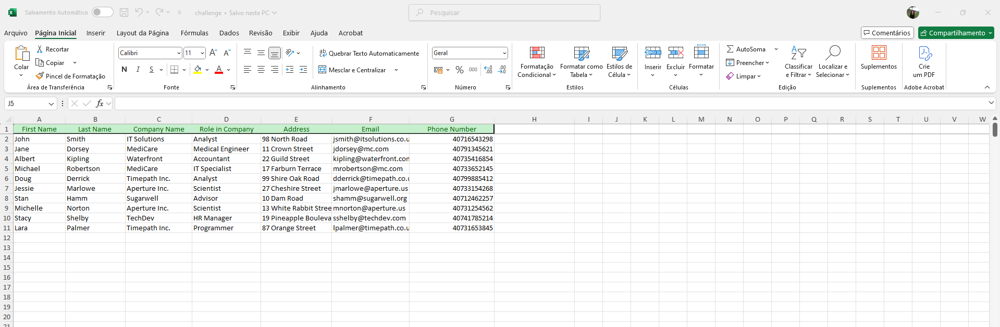
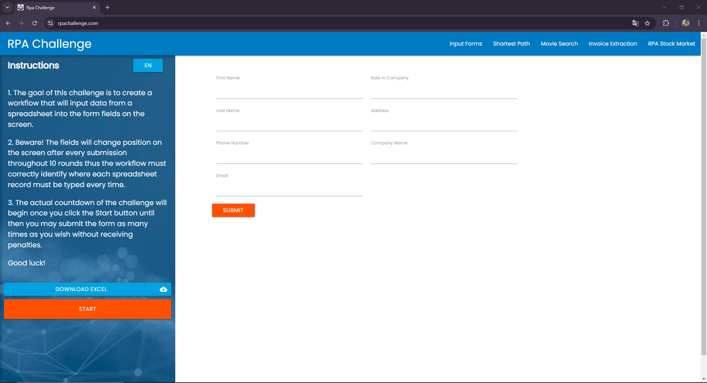

# RPA Challenge - Selenium/Python 🤖

## Descrição 📋

Este repositório contém uma implementação simples do primeiro desafio proposto no website [RPA Challenge](https://rpachallenge.com/). O objetivo do desafio é criar um fluxo que preencha os dados extraídos de uma planilha nas inputs da página. A planilha contém os dados de 10 funcionários fictícios contendo seus nomes, sobrenomes, e-mail, telefone, endereço e cargo em uma determinada empresa.

Mas há um pequeno detalhe, a página é mutável. As inputs mudam de posição na tela conforme os dados de cada cliente são submetidos no formulário da página. Além, disso os ids dos elementos mudam a cada execução.

## Ferramentas Utilizadas 🛠️

As ferramentas utilizadas para o desenvolvimento da automação foram as seguintes:

1. Python + Selenium para interação automática com a aplicação web
2. Pandas para manipulação e leitura de dados da planilha Excel
3. PyCharm como a IDE para desenvolvimento e debug
4. VENV para criação de um ambiente virtual e isolamento das bibliotecas e dependências
5. Git(Hub) para controle de versão e compartilhamento do código
6. XPATH personalizado para identificação de cada elemento da tela
